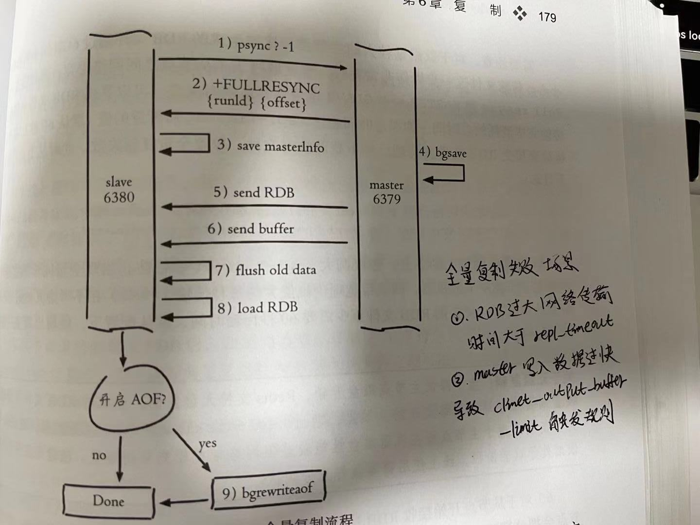
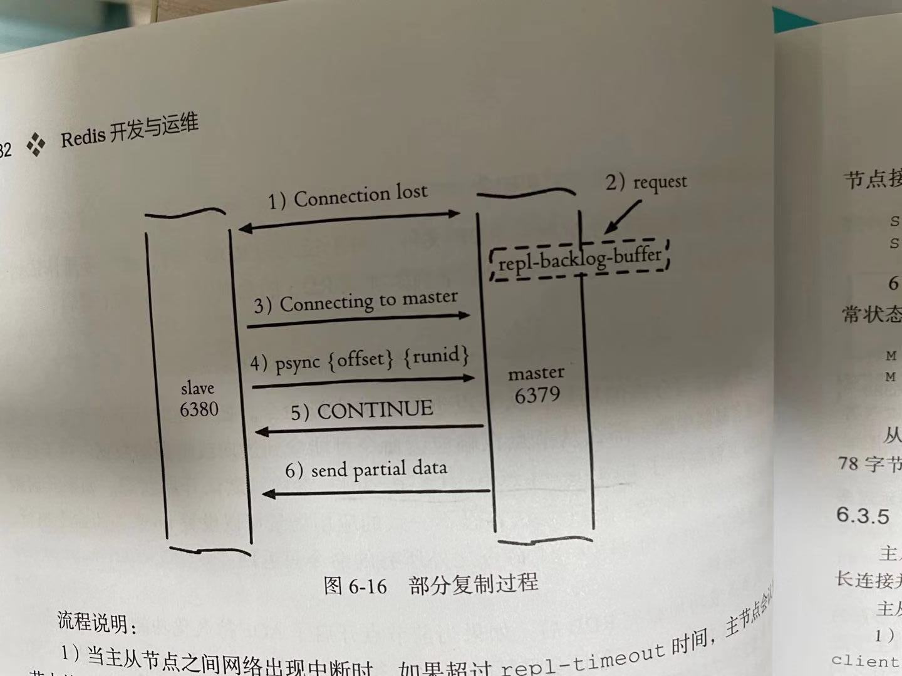

## 1、介绍

Redis从2.8版本开始，使用psync命令替代sync命令来执行复制时的操作，psync命令具有全量同步和部分同步的两种模式。

* 全量同步通过主服务器创建并发送RDB文件以及向slave发送保存在缓冲区里面的写命令来进行同步
* 部分同步则用于处理主从断线的情况，当slave断线重连后，master会根据slave 同步状态offset来从复制积压缓冲区里找到待同步的数据同步给slave,如果复制积压缓冲区里没有这个offset,那么会触发一次全量同步

## 2、复制流程

