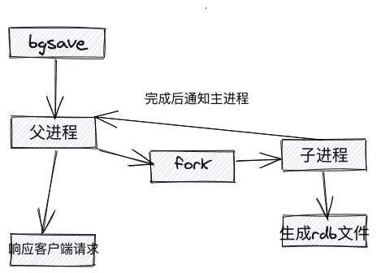
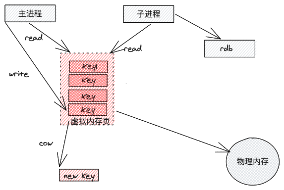
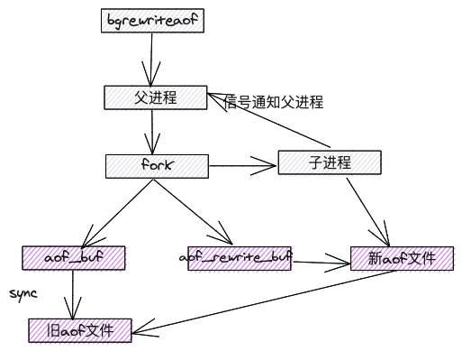

# 一、背景

Redis有两种持久化的方式RDB和AOF，其中RDB是一份内存快照，AOF则为可回放的命令日志。他们两个各有特点也相互独立。4.0开始允许使用RDB-AOF混合持久化的方式结合了两者的优点通过aof-use-rdb-preamble配置项可以打开混合开关。

# 二、RDB VS AOF

## 1、RDB

RDB文件本质上是一份内存快照保存了创建RDB文件那个时间点的redis全量数据具有数据文件小创建、恢复快的优点但是由于快照的特性无法保存创建RDB之后的增量数据。

### 1.1 触发机制

* 通过命令执行命令:save（不要使用会阻塞主进程）,bgsave（后台启动子进程执行)
* 通过配置配置文件配置"save m n",表示m秒内数据集存在n次修改时，自动触发bgsave

### 1.2  bgsave流程




* 主进程开始执行bgsave,确保当前没有bgsave在执行，否则直接返回
* 父进程执行fork操作，生成子进程，父进程在fork时会阻塞（根据内存大小阻塞时间不同，通常很快可以通过查看

info stats命令查看latest_fork_usec来查看单位微妙)，fork调用完成后，父进程继续响应客户端请求

* 子进程负责创建rdb文件，根据内存的数据生成临时快照文件，完成后替换旧的rdb文件

？问题：

bgsave执行时，子进程负责持久化数据，父进程还可以正常处理客户端请求，那么在客户端发来的写请求处理时，子进程持久化的数据是旧数据还是新来的数据也持久化了？

解答：

持久化采用了linux 的Copy On Write机制，来减少内存的占用。

* RDB过程中会fork一个子进程，子进程做数据备份操作，主进程继续对外提供服务，所有Redis服务不会阻塞；
* Redis中执行BGSAVE命令生成RDB文件时，本质就是调用Linux中的fork()命令，Linux下的fork()系统调用实现了copy-on-write写时复制，子进程备份的数据是开始那个时刻内存中的数据；
* 当父进程接受到客户端的写请求时，父进程会从新申请新的内存，把修改的内容存放到新的内存地址，而这时子进程的内存页还是指向旧的物理内存地址。这个过程如下图所示：




## 2、AOF

AOF文件本质上是一份执行日志保存所有对redis进行更改的命令增量数据也就随命令写入AOF文件刷盘的策略由配置项appendfsync控制可以选择"everysec"或"always"。

AOF文件基本上是human-readable的文本所以其体积相对较大在从AOF文件恢复数据时就是做日志回放执行AOF文件中记录的所有命令所以相对RDB而言恢复耗时较长。

随着redis的运行AOF文件会不断膨胀由aofrewrite机制来防止文件过大。

### 2.1 触发机制

* 通过配置文件配置appendonly yes

### 2.2 流程


### 2.3 aof rewrite

因为aof文件存储的是命令文本，文件内容会很大，并且由于相同key的多个写命令都会记录，过期的key,造成了许多冗余的记录。在redis重启加载aof文件时会导致加载很慢，redis提供了aof rewrite机制，定义的重建aof文件。

* 触发机制 

  手动触发：直接调用bgrewriteaof

  自动触发：根据auto-of-rewrite-min-size和auto-aof-rewrite-percentage参数确定自动触发机制

* 流程



# 三、RDB,AOF 混合持久化

Redis4.0开始支持混合持久化，混合持久化就是同时使用RDB和AOF两种持久化方式，在aofrewrite时，先把内存快照以RDB文件格式写入文件，写入完成时，在把增量的数据通过aof文件格式写入文件，最终完成数据的持久化。

## 1、aofrewrite执行时机

无论是aofrewrite自动触发（通过配置达到出发条件）或手工执行命令(BGAOFREWRITE)，最终redis都会调用rewriteAppendOnlyFileBackground()函数，这个函数会fork子进程来调用rewriteAppendOnlyFile函数来生成新的AOF文件。

```c++
int rewriteAppendOnlyFile(char *filename) {
    ...
    if (server.aof_use_rdb_preamble) {
        int error;
        if (rdbSaveRio(&aof,&error,RDB_SAVE_AOF_PREAMBLE,NULL) == C_ERR) {
            errno = error;
            goto werr;
        }
    } else {
        if (rewriteAppendOnlyFileRio(&aof) == C_ERR) goto werr;
    }
    ...
}
```

## 2、持久化过程

通过分析rerwiteAppendOnlyFile,可以看到当混合持久化开关打开时就会进入rdbSaveRio函数先以RDB格式来保存全量数据

```c++
前文说道子进程在做aofrewrite时会通过管道从父进程读取增量数据并缓存下来

那么在以RDB格式保存全量数据时也会从管道读取数据并不会造成管道阻塞
```

```c++
int rdbSaveRio(rio *rdb, int *error, int flags, rdbSaveInfo *rsi) {
    ...
    snprintf(magic,sizeof(magic),"REDIS%04d",RDB_VERSION);
    if (rdbWriteRaw(rdb,magic,9) == -1) goto werr;
    if (rdbSaveInfoAuxFields(rdb,flags,rsi) == -1) goto werr;
```

- 首先把RDB的版本注意不是redis的版本和辅助域写入文件

```c++
    for (j = 0; j < server.dbnum; j++) {
        redisDb *db = server.db+j;
        dict *d = db->dict;
        if (dictSize(d) == 0) continue;
        di = dictGetSafeIterator(d);
        if (!di) return C_ERR;

        /* Write the SELECT DB opcode */
        if (rdbSaveType(rdb,RDB_OPCODE_SELECTDB) == -1) goto werr;
        if (rdbSaveLen(rdb,j) == -1) goto werr;

        /* Write the RESIZE DB opcode. We trim the size to UINT32_MAX, which
         * is currently the largest type we are able to represent in RDB sizes.
         * However this does not limit the actual size of the DB to load since
         * these sizes are just hints to resize the hash tables. */
        uint32_t db_size, expires_size;
        db_size = (dictSize(db->dict) <= UINT32_MAX) ?
                                dictSize(db->dict) :
                                UINT32_MAX;
        expires_size = (dictSize(db->expires) <= UINT32_MAX) ?
                                dictSize(db->expires) :
                                UINT32_MAX;
        if (rdbSaveType(rdb,RDB_OPCODE_RESIZEDB) == -1) goto werr;
        if (rdbSaveLen(rdb,db_size) == -1) goto werr;
        if (rdbSaveLen(rdb,expires_size) == -1) goto werr;
```

- 然后遍历DB先把dbnum和db_size、expires_size写入文件

```c++
        /* Iterate this DB writing every entry */
        while((de = dictNext(di)) != NULL) {
            sds keystr = dictGetKey(de);
            robj key, *o = dictGetVal(de);
            long long expire;

            initStaticStringObject(key,keystr);
            expire = getExpire(db,&key);
            if (rdbSaveKeyValuePair(rdb,&key,o,expire,now) == -1) goto werr;

            /* When this RDB is produced as part of an AOF rewrite, move
             * accumulated diff from parent to child while rewriting in
             * order to have a smaller final write. */
            if (flags & RDB_SAVE_AOF_PREAMBLE &&
                rdb->processed_bytes > processed+AOF_READ_DIFF_INTERVAL_BYTES)
            {
                processed = rdb->processed_bytes;
                aofReadDiffFromParent();
            }
        }
        dictReleaseIterator(di);
    }
    di = NULL; /* So that we don't release it again on error. */
```

- 在当前DB中遍历所有的key把key-value对及过期时间如果有设置的话写入文件

  ```c++
  这里小插曲一下在rdbSaveKeyValuePair函数中会判断expire是否已经到了过期时间如果已经过期就不会写入文件
  
  同时如果flags标记了RDB_SAVE_AOF_PREAMBLE的话说明是在aofrewrite且开启了RDB-AOF混合开关此时就会从父进程去读取增量数据了
  ```

  

```c++
    /* EOF opcode */
    if (rdbSaveType(rdb,RDB_OPCODE_EOF) == -1) goto werr;

    /* CRC64 checksum. It will be zero if checksum computation is disabled, the
     * loading code skips the check in this case. */
    cksum = rdb->cksum;
    memrev64ifbe(&cksum);
    if (rioWrite(rdb,&cksum,8) == 0) goto werr;
    return C_OK;
}
```

- 最后把代表RDB格式结束的RDB_OPCODE_EOF标记和校验和写入文件

RDB-AOF混合持久化的RDB部分到此结束rdbSaveRio函数运行完后返回rewriteAppendOnlyFile继续把增量数据写入AOF文件。

也就是说AOF文件的前半段是RDB格式的全量数据后半段是redis命令格式的增量数据。

# 四、数据恢复

当appendonly配置项为no时redis启动后会去加载RDB文件以RDB格式来解析RDB文件自然没有问题。

而appendonly配置项为yes时redis启动后会加载AOF文件来恢复数据如果持久化时开启了RDB-AOF混合开关那么AOF文件的前半段就是RDB格式此时要如何正确加载数据呢

一切数据都逃不过协议二字不以正确的协议存储和解析那就是乱码既然允许RDB-AOF混合持久化就要能够识别并恢复数据这一节我们来介绍如何以正确的姿势来恢复数据。

加载AOF文件的入口为loadAppendOnlyFile

```c
int loadAppendOnlyFile(char *filename) {
    ...
    /* Check if this AOF file has an RDB preamble. In that case we need to
     * load the RDB file and later continue loading the AOF tail. */
    char sig[5]; /* "REDIS" */
    if (fread(sig,1,5,fp) != 5 || memcmp(sig,"REDIS",5) != 0) {
        /* No RDB preamble, seek back at 0 offset. */
        if (fseek(fp,0,SEEK_SET) == -1) goto readerr;
    } else {
        /* RDB preamble. Pass loading the RDB functions. */
        rio rdb;

        serverLog(LL_NOTICE,"Reading RDB preamble from AOF file...");
        if (fseek(fp,0,SEEK_SET) == -1) goto readerr;
        rioInitWithFile(&rdb,fp);
        if (rdbLoadRio(&rdb,NULL) != C_OK) {
            serverLog(LL_WARNING,"Error reading the RDB preamble of the AOF file, AOF loading aborted");
            goto readerr;
        } else {
            serverLog(LL_NOTICE,"Reading the remaining AOF tail...");
        }
    }
    ...
}

```

打开AOF文件之后首先读取5个字符如果是"REDIS"那么就说明这是一个混合持久化的AOF文件正确的RDB格式一定是以"REDIS"开头而纯AOF格式则一定以"*"开头此时就会进入rdbLoadRio函数来加载数据。

rdbLoadRio函数此处就不详细展开了就是以约定好的协议解析文件内容直至遇到RDB_OPCODE_EOF结束标记返回loadAppendOnlyFile函数继续以AOF格式解析文件直到结束整个加载过程完成。

# 五、附录

## 1、RDB 文件格式

我们先向redis写入一些数据并生成RDB文件

```shell
$redis-cli
127.0.0.1:6379> set foo bar
OK
127.0.0.1:6379> expire foo 60
(integer) 1
127.0.0.1:6379> select 2
OK
127.0.0.1:6379[2]> set foo bar
OK
127.0.0.1:6379[2]> bgsave
Background saving started
```

看下RDB文件内容

```properties
$cat dump.rdb
REDIS0008    redis-ver4.0.1
redis-bits@ctimeYused-mem 
                                aof-preamblerepl-id(484f9d49a700c4b9b136f0fd40d2d6e5a8460438
                                                                                               repl-offa;^foobarfoobar^KJ_U
```

OMG...一堆乱码隐约可以看到一些和redis相关的字符串为了更直观的感受下RDB的内容我们用redis自带的工具redis-check-rdb来看下

```properties
redis-check-rdb dump.rdb
[offset 0] Checking RDB file dump.rdb
[offset 26] AUX FIELD redis-ver = '4.0.1'
[offset 40] AUX FIELD redis-bits = '64'
[offset 52] AUX FIELD ctime = '1504234774'
[offset 67] AUX FIELD used-mem = '2139016'
[offset 83] AUX FIELD aof-preamble = '0'
[offset 133] AUX FIELD repl-id = '484f9d49a700c4b9b136f0fd40d2d6e5a8460438'
[offset 148] AUX FIELD repl-offset = '0'
[offset 150] Selecting DB ID 0
[offset 173] Selecting DB ID 2
[offset 194] Checksum OK
[offset 194] \o/ RDB looks OK! \o/
[info] 2 keys read
[info] 1 expires
[info] 0 already expired
```


这下就好看多了首先可以看到是一些AUX FIELD辅助域4.0特有用来配合全新的主从同步方式PSYNC2后面会专门来介绍PSYNC2然后可以看到DB0和DB2是有内容的Checksum也OK最后是说一共有2个key其中一个设置了过期时间到目前为止还都没有过期。

## 2、AOF文件格式

同样的数据我们来看下在AOF文件中是如何保存的

```properties
$cat appendonly.aof
*2
$6
SELECT
$1
0
*3
$3
set
$3
foo
$3
bar
*3
$9
PEXPIREAT
$3
foo
$13
1504255377087
*2
$6
SELECT
$1
2
*3
$3
set
$3
foo
$3
bar
```

很明显就是一条一条redis命令。

## 3. RDB-AOF混和持久化的文件

最后来看下RDB-AOF混和持久化的文件。

首先打开混合开关执行BGREWRITEAOF生成RDB-AOF混合文件再追加写入一些数据

```shell
$redis-cli
127.0.0.1:6379> config set aof-use-rdb-preamble yes
OK
127.0.0.1:6379> BGREWRITEAOF
Background append only file rewriting started
127.0.0.1:6379> set foo bar
OK
127.0.0.1:6379> quit
```

再来看下此时AOF文件内容

```properties
$cat appendonly.aof
REDIS0008    redis-ver4.0.1
redis-bits@ctimeYused-memP 
                                  aof-preamblerepl-id(484f9d49a700c4b9b136f0fd40d2d6e5a8460438
                                                                                                 repl-offsetfoobar?I    Y*2
$6
SELECT
$1
0
*3
$3
set
$3
foo
$3
bar
```

显而易见前半段是RDB格式的全量数据后半段是redis命令格式的增量数据。

参考

https://developer.aliyun.com/article/193034
